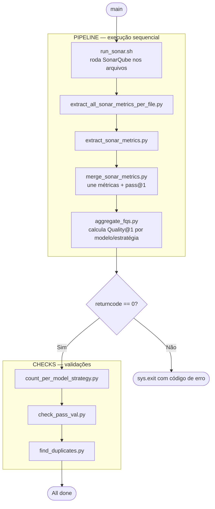
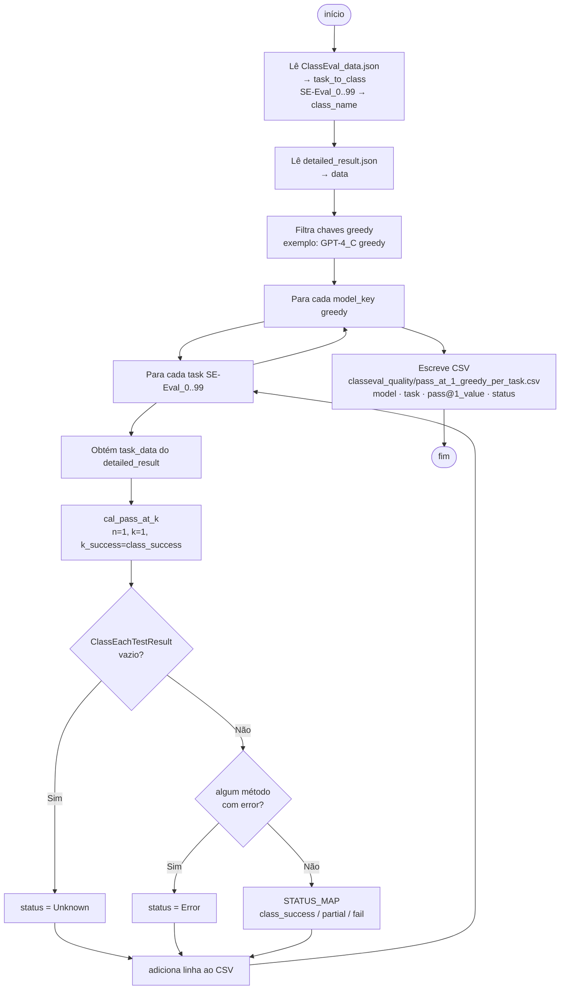
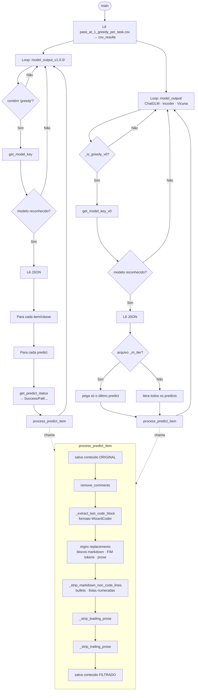

# Quality@K — Análise de Qualidade Estática de Código Gerado por LLMs

> 🇺🇸 [Read in English](docs/README.en.md)

Este repositório contém o pipeline de análise estática utilizado no TCC *"Avaliação da Qualidade de Código Gerado por Large Language Models"*. O objetivo é investigar se código funcionalmente correto (medido pelo Pass@k do benchmark ClassEval) também apresenta boa qualidade estrutural, medida via SonarQube.

## Contexto

O benchmark [ClassEval](https://github.com/FudanSELab/ClassEval) avalia LLMs na geração de classes Python completas com 100 tarefas. Este trabalho analisa **11 modelos × 3 estratégias + GroundTruth = 34 grupos**:

| Modelo | Perfil |
|--------|--------|
| GPT-4-Turbo | Alto desempenho |
| GPT-3.5-Turbo | Alto desempenho |
| WizardCoder-15B-V1.0 | Alto desempenho |
| starcoder-instruct-15B | Médio desempenho |
| instruct-codegen-16B | Médio desempenho |
| Vicuna | Médio desempenho |
| ChatGLM | Médio desempenho |
| codegeex2-6b | Baixo desempenho |
| incoder | Baixo desempenho |
| santacoder-1.1B | Baixo desempenho |
| PolyCoder-2.7B | Baixo desempenho |
| GroundTruth | Referência humana (ClassEval) |

### Estratégias de Geração

| Sigla | Estratégia | Descrição |
|-------|-----------|-----------|
| `H` | Holística | Gera a classe completa de uma só vez |
| `I` | Incremental | Constrói método a método, usando o resultado anterior como contexto |
| `C` | Composicional | Constrói método a método de forma independente |

Os diretórios em `data/` combinam modelo e estratégia — por exemplo, `GPT-4-Turbo_method_C_greedy` representa o GPT-4-Turbo com estratégia Composicional e decodificação gulosa.

### Métricas Coletadas

- **Complexidade Cognitiva** — esforço mental para compreender o código
- **Complexidade Ciclomática** — quantidade de caminhos independentes no fluxo de execução
- **Code Smells** — indícios de más práticas que impactam manutenibilidade
- **SQALE Index** — dívida técnica acumulada em minutos (SonarQube)
- **Quality@1 (FQS)** — métrica proposta neste trabalho, combina Pass@1 e dívida técnica normalizada por LOC

## Pré-requisitos

- [Docker](https://www.docker.com/) instalado e em execução

## Executando o SonarQube

A imagem já contém todos os projetos analisados, com métricas e usuários configurados. Basta executar:

```bash
docker compose up
```

O SonarQube estará disponível em [http://localhost:9000](http://localhost:9000).

| Campo | Valor |
|-------|-------|
| Usuário | `admin` |
| Senha | `sonarLike@21` |

> Na primeira inicialização, o SonarQube pode levar alguns minutos para reconstruir o índice de busca interno a partir do banco de dados. Aguarde até a interface estar totalmente disponível.

## Pipeline de Quality@1

### Fórmula

```
Quality@1(t) = Pass@1(t) × (1 − min(1, β × SQALE_Index(t) / NCLOC(t)))
```

Onde `Pass@1(t) ∈ {0, 1}`, `β = 0.1`, `SQALE_Index` é a dívida técnica em minutos (SonarQube) e `NCLOC` é o número de linhas de código não comentadas.

### Como executar

Com Python 3 e pandas instalados:

```bash
python3 scripts/run_pipeline.py
```

Etapas executadas automaticamente:

| Passo | Script | Descrição |
|-------|--------|-----------|
| 1 | `run_sonar.sh` | Envia cada projeto para o SonarQube via `pysonar` |
| 2 | `extract_all_sonar_metrics_per_file.py` | Extrai métricas por arquivo de todos os projetos via API do SonarQube |
| 3 | `extract_sonar_metrics.py` | Extrai métricas agregadas por projeto via API do SonarQube |
| 4 | `merge_sonar_metrics.py` | Consolida os CSVs brutos + `pass_at_1_greedy_per_task.csv`, calcula FQS por tarefa |
| 5 | `aggregate_fqs.py` | Calcula a média de FQS por (modelo, estratégia) |

Após o pipeline, são executados automaticamente os scripts de diagnóstico:

| Script | Descrição |
|--------|-----------|
| `count_per_model_strategy.py` | Conta o total de tarefas por (modelo, estratégia) |
| `check_pass_val.py` | Verifica se os `pass_val` no CSV combinado batem com o arquivo de pass@1 |
| `find_duplicates.py` | Detecta tarefas duplicadas para o mesmo (modelo, estratégia) |



### Outputs

Todos os arquivos são gerados em `sonar-metrics/new/`:

| Arquivo | Descrição |
|---------|-----------|
| `raw/sonar_metrics_*_files.csv` | CSVs brutos do SonarQube — 1 por modelo/estratégia |
| `combined_sonar_metrics.csv` | ~3.400 linhas — métricas SonarQube + FQS por tarefa |
| `fqs_aggregated.csv` | 34 linhas — FQS médio por modelo/estratégia, ordenado do maior para o menor |
| `pass_at_1_greedy_per_task.csv` | Input: mapeamento (modelo, tarefa) → pass@1 binário |

---

## Reanalisando os projetos

Caso os arquivos em `data/` sejam alterados ou você queira reprocessar as análises do zero:

```bash
# certifique-se de que o SonarQube esteja rodando
docker compose up -d

./run_sonar.sh
```

O script envia cada projeto para o SonarQube via `pysonar`, usando os tokens de autenticação já configurados.

## Origem do diretório `data/`

O diretório `data/` é o resultado final de um pipeline de dois passos executado a partir dos arquivos brutos do benchmark [ClassEval](https://github.com/FudanSELab/ClassEval). O fluxo completo é:

```
ClassEval (output/model_output_v1.0.0/)
        │
        │  scripts/take_solution.py
        ▼
classEval_output/          ← artefato intermediário (neste repositório)
        │
        │  scripts/group_filtered_solutions.py
        ▼
data/                      ← entrada do SonarQube
```

### Pré-requisito — `scripts/generate_pass_at_1_greedy.py`

Gera o arquivo `classeval_quality/pass_at_1_greedy_per_task.csv` que é consumido pelo `take_solution.py` para nomear cada solução com seu desfecho nos testes.



### Passo 1 — `scripts/take_solution.py`

Lê os JSONs brutos em `output/model_output_v1.0.0/` do ClassEval, extrai o campo `predict` de cada geração e:

- Remove artefatos de Markdown e linguagem natural das respostas dos modelos
- Cruza cada geração com `output/result/detailed_result.json` para obter o desfecho nos testes unitários (`Success`, `PartialSuccess`, `Fail`, `Error`)
- Nomeia cada arquivo com o padrão `<Classe><Status>.py` — por exemplo, `AccessGatewayFilterError.py`
- Salva as versões original e sanitizada separadamente

O resultado é salvo em `classEval_output/`, com a seguinte estrutura:

```
classEval_output/
└── GPT-4-Turbo_class_H_greedy/
    └── AccessGatewayFilter/
        ├── filtered/
        │   └── AccessGatewayFilterError.py   ← código sanitizado
        └── original/
            └── AccessGatewayFilterError.py   ← resposta bruta do modelo
```



### Passo 2 — `scripts/group_filtered_solutions.py`

Lê os arquivos `filtered/` de `classEval_output/` e os reorganiza em uma estrutura plana por modelo/estratégia, que é o formato esperado pelo SonarQube e pelo `run_sonar.sh`:

```
data/
└── GPT-4-Turbo_method_C_greedy/
    ├── AccessGatewayFilterError.py
    ├── AccessGatewayFilterSuccess.py
    └── ...
```

## Estrutura

```
.
├── compose.yaml                         # Sobe o SonarQube com a imagem pré-populada
├── run_sonar.sh                         # Reenvia todos os projetos ao SonarQube
├── sonar-project.properties             # Configuração base dos projetos Sonar
│
├── scripts/
│   ├── run_pipeline.py                  # Executa o pipeline completo de Quality@1
│   │
│   ├── # — Extração (SonarQube API) —
│   ├── extract_all_sonar_metrics_per_file.py  # Extrai métricas por arquivo de todos os projetos
│   ├── extract_sonar_metrics_per_file.py      # Extrai métricas por arquivo de um projeto
│   ├── extract_sonar_metrics.py               # Extrai métricas agregadas por projeto
│   │
│   ├── # — Pipeline principal —
│   ├── merge_sonar_metrics.py           # Consolida CSVs brutos + calcula FQS por tarefa
│   ├── aggregate_fqs.py                 # Agrega FQS por (modelo, estratégia)
│   ├── compute_fqs.py                   # Função pura da fórmula Quality@1
│   ├── sort_csv.py                      # Ordena um CSV por (modelo, estratégia, arquivo)
│   │
│   ├── # — Diagnóstico —
│   ├── check_pass_val.py                # Valida pass_val no CSV combinado vs arquivo de pass@1
│   ├── count_per_model_strategy.py      # Conta tarefas por (modelo, estratégia)
│   ├── find_duplicates.py               # Detecta tarefas duplicadas por (modelo, estratégia)
│   ├── diff_csv.py                      # Diff de pass_val/fqs entre dois CSVs
│   │
│   ├── # — Preparação dos dados —
│   ├── take_solution.py                 # Extrai soluções dos JSONs do ClassEval
│   ├── group_filtered_solutions.py      # Reorganiza para o formato do SonarQube
│   └── prioritize_duplicates.py        # Remove duplicatas por prioridade de status
│
├── sonar-metrics/
│   └── new/
│       ├── raw/                         # CSVs brutos do SonarQube (1 por modelo/estratégia)
│       │   └── sonar_metrics_*_files.csv
│       ├── combined_sonar_metrics.csv   # Saída principal: métricas + FQS por tarefa
│       ├── fqs_aggregated.csv           # FQS médio por modelo/estratégia
│       └── pass_at_1_greedy_per_task.csv  # Input: (modelo, tarefa) → pass@1
│
├── classeval_output/                    # Saída intermediária do take_solution.py
└── data/                                # Entrada do SonarQube
    ├── GPT-4-Turbo_class_H_greedy/
    ├── PolyCoder-2.7B_class_H_greedy/
    ├── groundTruth/
    └── ...
```

## Reconstruindo a imagem Docker

Se precisar publicar uma nova versão da imagem após novas análises:

```bash
# 1. Suba o SonarQube e rode as análises
docker compose up -d
./run_sonar.sh

# 2. Extraia os dados do container em execução
docker cp <container_id>:/opt/sonarqube/data ./sonar-data/sonarqube-data
docker cp <container_id>:/opt/sonarqube/extensions ./sonar-data/sonarqube-extensions

# 3. Reconstrua e publique
docker build -t beposs/class_eval_sonar:latest .
docker push beposs/class_eval_sonar:latest
```

> A pasta `sonar-data/` está no `.gitignore` — é gerada localmente apenas durante o build da imagem.
