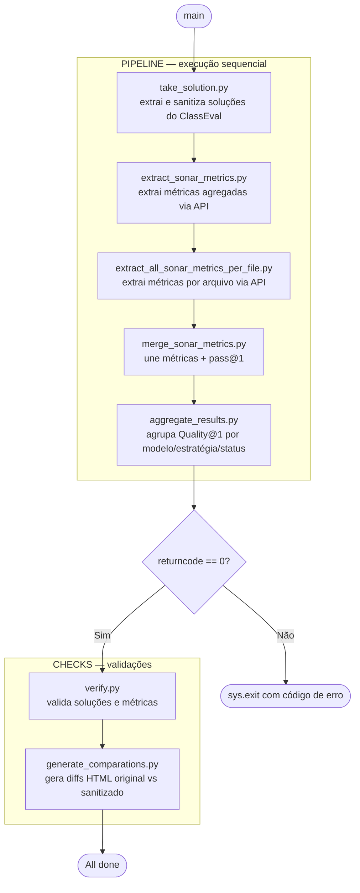

# Quality@K — Análise de Qualidade Estática de Código Gerado por LLMs

> 🇺🇸 [Read in English](docs/README.en.md)

Este repositório contém o pipeline de análise estática utilizado no TCC *"Avaliação da Qualidade de Código Gerado por Large Language Models"*. O objetivo é investigar se código funcionalmente correto (medido pelo Pass@k do benchmark ClassEval) também apresenta boa qualidade estrutural, medida via SonarQube.

## Contexto

O benchmark [ClassEval](https://github.com/FudanSELab/ClassEval) avalia LLMs na geração de classes Python completas com 100 tarefas. Este trabalho analisa **11 modelos × 3 estratégias + GroundTruth = 34 grupos**:

| Modelo | Perfil |
|--------|--------|
| GPT-4-Turbo | Alto desempenho |
| GPT-3.5-Turbo | Alto desempenho |
| WizardCoder-15B-V1.0 | Alto desempenho |
| starcoder-instruct-15B | Médio desempenho |
| instruct-codegen-16B | Médio desempenho |
| Vicuna | Médio desempenho |
| ChatGLM | Médio desempenho |
| codegeex2-6b | Baixo desempenho |
| incoder | Baixo desempenho |
| santacoder-1.1B | Baixo desempenho |
| PolyCoder-2.7B | Baixo desempenho |
| GroundTruth | Referência humana (ClassEval) |

### Estratégias de Geração

| Sigla | Estratégia | Descrição |
|-------|-----------|-----------|
| `H` | Holística | Gera a classe completa de uma só vez |
| `I` | Incremental | Constrói método a método, usando o resultado anterior como contexto |
| `C` | Composicional | Constrói método a método de forma independente |

### Métricas Coletadas

- **Complexidade Cognitiva** — esforço mental para compreender o código
- **Complexidade Ciclomática** — quantidade de caminhos independentes no fluxo de execução
- **Code Smells** — indícios de más práticas que impactam manutenibilidade
- **SQALE Index** — dívida técnica acumulada em minutos (SonarQube)
- **Quality@1 (FQS)** — métrica proposta neste trabalho, combina Pass@1 e dívida técnica normalizada por LOC

## Pré-requisitos

- [Docker](https://www.docker.com/) instalado e em execução
- `output/ClassEval_output/` populado com os arquivos brutos do ClassEval (JSONs de saída dos modelos e `detailed_result.json`)

## Executando o SonarQube

A imagem já contém todos os projetos analisados, com métricas e usuários configurados. Basta executar:

```bash
docker compose up
```

O SonarQube estará disponível em [http://localhost:9000](http://localhost:9000).

| Campo | Valor |
|-------|-------|
| Usuário | `admin` |
| Senha | `sonarLike@21` |

> Na primeira inicialização, o SonarQube pode levar alguns minutos para reconstruir o índice de busca interno a partir do banco de dados. Aguarde até a interface estar totalmente disponível.

## Pipeline de Quality@1

### Fórmula

```
Quality@1(t) = Pass@1(t) × (1 − min(1, β × SQALE_Index(t) / NCLOC(t)))
```

Onde `Pass@1(t) ∈ {0, 1}`, `β = 0.1`, `SQALE_Index` é a dívida técnica em minutos (SonarQube) e `NCLOC` é o número de linhas de código não comentadas.

### Como executar

Com Python 3 e pandas instalados:

```bash
python3 scripts/pipeline.py
```

Etapas executadas automaticamente:

| Passo | Script | Descrição |
|-------|--------|-----------|
| 1 | `take_solution.py` | Extrai e sanitiza soluções dos JSONs do ClassEval; gera `pass_results.csv` |
| 2 | `extract_sonar_metrics.py` | Extrai métricas agregadas por projeto via API do SonarQube |
| 3 | `extract_all_sonar_metrics_per_file.py` | Extrai métricas por arquivo de todos os projetos via API do SonarQube |
| 4 | `merge_sonar_metrics.py` | Consolida os CSVs brutos + `pass_results.csv`, calcula FQS por tarefa |
| 5 | `aggregate_results.py` | Agrega FQS por `(modelo, estratégia, status)` |

Após o pipeline, são executados automaticamente os scripts de diagnóstico:

| Script | Descrição |
|--------|-----------|
| `verify.py` | Valida contagem (100 classes/modelo), detecta contaminação Markdown, erros de AST e divergências entre `combined_sonar_metrics.csv` e `pass_results.csv` |
| `generate_comparations.py` | Gera diffs HTML (original vs. sanitizado) por modelo em `output/validation/` |



### Outputs

Todos os arquivos são gerados em `output/`:

| Arquivo | Descrição |
|---------|-----------|
| `output/solutions/{modelo}/*.py` | Soluções sanitizadas por modelo |
| `output/solutions/originals/{modelo}/*.py` | Respostas brutas dos modelos |
| `output/results/raw/sonar_metrics*.csv` | CSVs brutos do SonarQube — métricas por arquivo |
| `output/results/pass_results.csv` | Input: mapeamento `(modelo, classe)` → `pass@1` + status |
| `output/results/combined_sonar_metrics.csv` | Saída principal: métricas SonarQube + FQS por tarefa |
| `output/results/aggregated_results.csv` | FQS médio por `(modelo, estratégia, status)` |
| `output/validation/comparation-{llm}.html` | Diffs HTML: original vs. sanitizado por modelo |

---

## Reanalisando os projetos

Caso queira reenviar os projetos ao SonarQube do zero:

```bash
# certifique-se de que o SonarQube esteja rodando
docker compose up -d

./scripts/run_sonar.sh
```

O script envia cada projeto para o SonarQube via `sonar-scanner`, usando os tokens de autenticação já configurados.

## Estrutura

```
.
├── compose.yaml                              # Sobe o SonarQube com a imagem pré-populada
├── scripts/
│   ├── pipeline.py                           # Executa o pipeline completo de Quality@1
│   │
│   ├── # — Extração (SonarQube API) —
│   ├── extract_all_sonar_metrics_per_file.py # Extrai métricas por arquivo de todos os projetos
│   ├── extract_sonar_metrics.py              # Extrai métricas agregadas por projeto
│   │
│   ├── # — Pipeline principal —
│   ├── take_solution.py                      # Extrai e sanitiza soluções dos JSONs do ClassEval
│   ├── merge_sonar_metrics.py                # Consolida CSVs brutos + calcula FQS por tarefa
│   ├── aggregate_results.py                  # Agrega FQS por (modelo, estratégia, status)
│   ├── compute_fqs.py                        # Função pura da fórmula Quality@1
│   ├── sort_csv.py                           # Ordena um CSV por (modelo, estratégia, arquivo)
│   │
│   ├── # — Diagnóstico —
│   ├── verify.py                             # Valida soluções e cruza métricas com pass_results.csv
│   ├── generate_comparations.py             # Gera diffs HTML original vs sanitizado por modelo
│   │
│   └── # — SonarQube —
│       ├── run_sonar.sh                      # Reenvia todos os projetos ao SonarQube
│       ├── setup_sonar_projects.sh           # Cria projetos e tokens no SonarQube
│       └── delete_sonar_projects.sh          # Remove projetos do SonarQube
│
└── output/
    ├── ClassEval_output/                     # Input: arquivos brutos do ClassEval (pré-existente)
    │   ├── model_output_v1.0.0/             # JSONs de saída dos modelos
    │   └── result/
    │       └── detailed_result.json
    ├── solutions/                            # Gerado por take_solution.py
    │   ├── {modelo}/
    │   │   └── *.py                         # Soluções sanitizadas
    │   └── originals/
    │       └── {modelo}/
    │           └── *.py                     # Respostas brutas
    ├── results/                             # Gerado pelo pipeline
    │   ├── raw/
    │   │   └── sonar_metrics*.csv           # Métricas brutas por arquivo
    │   ├── pass_results.csv                 # (modelo, classe) → pass@1 + status
    │   ├── combined_sonar_metrics.csv       # Saída principal: métricas + FQS por tarefa
    │   └── aggregated_results.csv           # FQS médio por (modelo, estratégia, status)
    └── validation/                          # Gerado por generate_comparations.py
        └── comparation-{llm}.html
```

## Reconstruindo a imagem Docker

Se precisar publicar uma nova versão da imagem após novas análises:

```bash
# 1. Suba o SonarQube e rode as análises
docker compose up -d
./scripts/run_sonar.sh

# 2. Extraia os dados do container em execução
docker cp quality-sonarqube-1:/opt/sonarqube/data ./sonar-data/sonarqube-data
docker cp quality-sonarqube-1:/opt/sonarqube/extensions ./sonar-data/sonarqube-extensions

# 3. Reconstrua e publique
docker build -t beposs/class_eval_sonar:latest .
docker push beposs/class_eval_sonar:latest
```

> A pasta `sonar-data/` está no `.gitignore` — é gerada localmente apenas durante o build da imagem.
